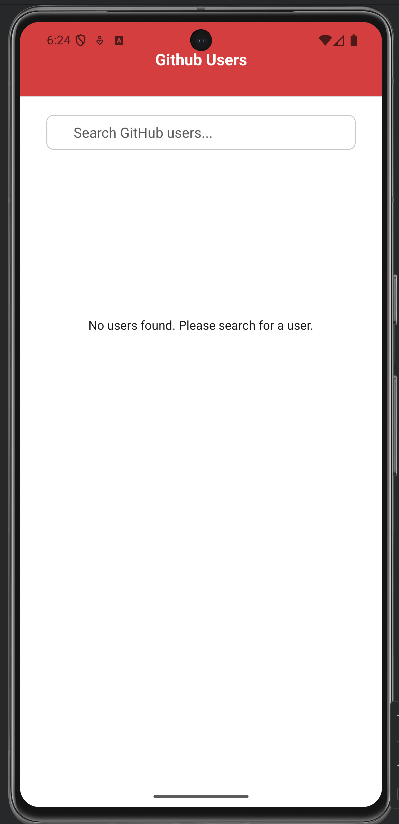
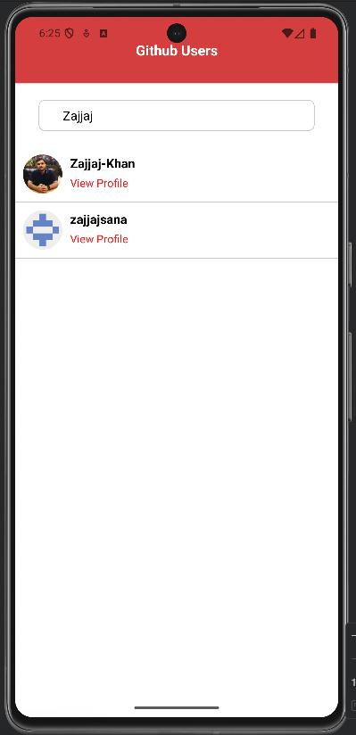
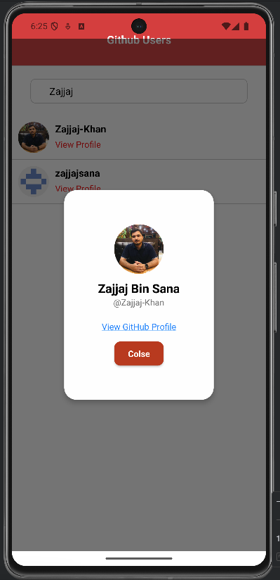

# GitHub Users React Native App

A simple React Native application that fetches and displays GitHub users using the GitHub API.  
Built with **React Native**, **Redux Toolkit**, and **TypeScript**.

---

## 📦 Prerequisites

Before you start, make sure you have the following installed:

- [Node.js](https://nodejs.org/) (LTS recommended)
- [npm](https://www.npmjs.com/) or [yarn](https://yarnpkg.com/)
- [React Native/Expo](https://reactnative.dev/docs/environment-setup) (for running on Android)
- [Android Studio](https://developer.android.com/studio) (for emulator or physical device setup)
- Git

---

## 🚀 Getting Started

### 1. Clone the Repository
```bash
git clone (https://github.com/Zajjaj-Khan/Github-React-native-Assignment.git)
cd YOUR_REPO
```
### 2. Intstall Required node modules
```bash
npm install
```
### 3. Run this command 
```bash
npm run android
```



